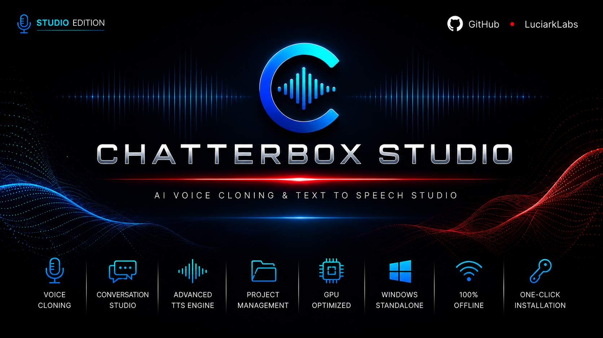
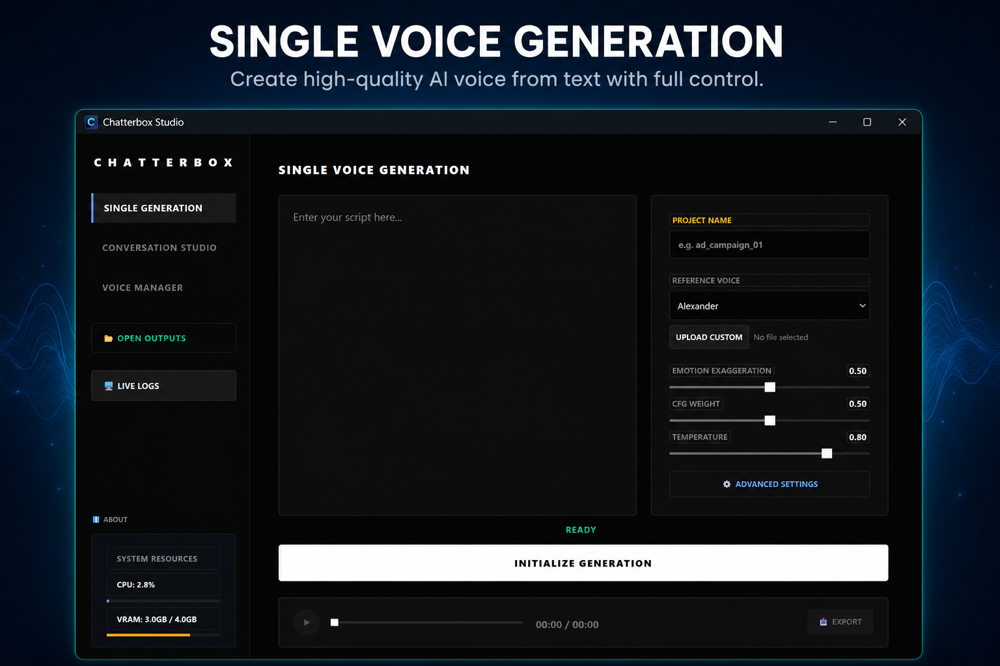
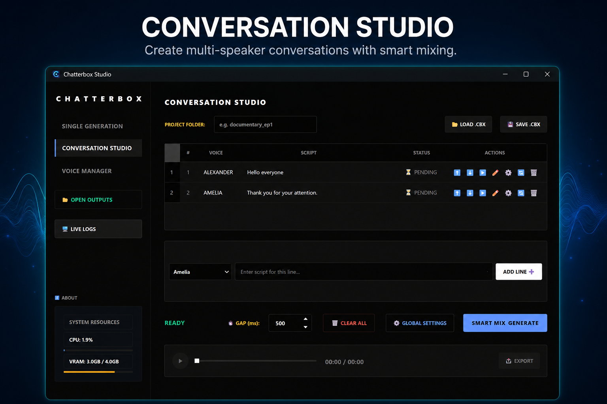
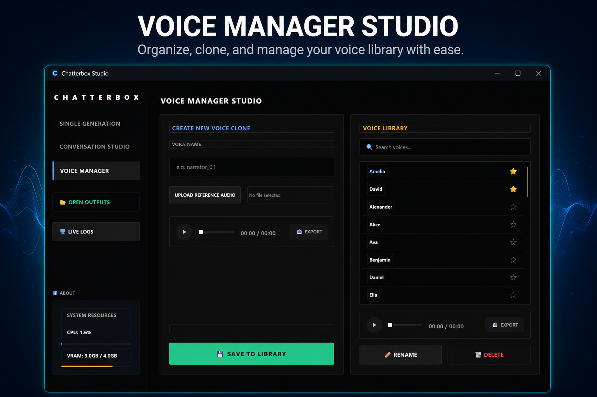

<div align="center">




### Offline Desktop Studio for AI Voice Cloning & Text-to-Speech


</div>

---

## Overview

Chatterbox Studio is a modern Windows desktop application that provides a professional graphical interface for the open-source **Chatterbox TTS** engine.

It enables high-quality speech generation, voice cloning, multi-speaker conversation creation, and voice library management through an intuitive desktop interface.

Unlike a typical source-code project, Chatterbox Studio is designed to work as a complete desktop application. The offline installer includes everything required to get started immediately—including the AI models and **30 high-quality pre-built voices**.

Built with **PySide6**, the application runs without requiring Python, Git, or any command-line setup.

---

## Features

- 🎁 30 high-quality built-in voices
- 🎙️ Offline AI voice generation
- 🧠 Voice cloning from reference audio
- 💬 Conversation Studio for multi-speaker projects
- 📁 Voice Library Manager
- ⭐ Favorites & voice search
- 📊 Live CPU / GPU / VRAM monitoring
- ⚙️ Advanced generation controls
- 🎵 Built-in audio preview player
- 💾 Project save & load (.cbx)
- 📦 Standalone Windows installer
- 🌐 Fully offline after installation

---

## Download

### Offline Installer (~3.5 GB)

➡️ **[Download Chatterbox Studio](https://huggingface.co/datasets/LuciarkLabs/Chatterbox-Studio-Releases/resolve/main/Chatterbox_Studio_Setup.exe?download=true)**

Includes:

- Desktop application
- AI models
- FFmpeg
- Required dependencies
- 30 built-in voices

---

### Online Installer *(Coming Soon)*

A lightweight installer that automatically downloads the required AI models during installation.

---

## Screenshots

### Single Generation



### Conversation Studio



### Voice Manager



---

## System Requirements

### Minimum

- Windows 10 / Windows 11 (64-bit)
- 8 GB RAM
- NVIDIA GPU recommended
- Approximately 8 GB free disk space

### Recommended

- NVIDIA RTX GPU with CUDA support
- 12 GB RAM or more

---

## Running from Source

```bash
git clone https://github.com/LuciarkLabs/Chatterbox-Studio.git

cd Chatterbox-Studio

pip install -r requirements.txt

python main.py
```

---

## Credits

Chatterbox Studio is a desktop interface built around the open-source **Chatterbox TTS** engine developed by **Resemble AI**.

The desktop application, user interface, packaging, installer, workflow improvements, and additional desktop features were developed by **LuciarkLabs**.

---

## License

The desktop application is released under the **MIT License**.

The underlying Chatterbox TTS engine remains subject to its original license.

See the **LICENSE** file for more information.
